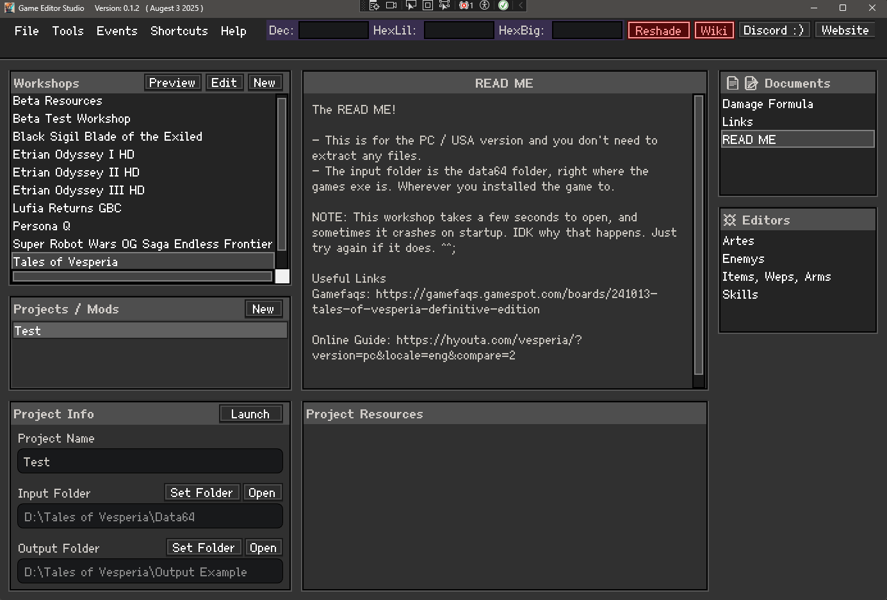

# Game Editor Studio

Game Editor Studio (GES) is a program that lets you create highly customizable editors for video games without any coding knowledge. GES is made with forward compatibility in mind, ensuring that future features will work seamlessly with existing editors.

## [Download Latest Build](https://github.com/dawnbomb/GameEditorStudio/releases/latest)
> Note that automatic updates are not a thing yet, so for now you will need to manually update every so often.

## Getting Started
If you want to create mods using existing editors, first select a game from the workshops list on the left side of the window. A readme will open, and it SHOULD tell you how to extract any game files required. Then create a new project for that workshop, set and input and output folder (Input is game files, output is where your modded files will save to), and launch your project! Your good to go!

If instead you want to create editors for a game noone has ever done before, you will need to create a new workshop for that game. Then make a dummy project for that workshop, launch the workshop, then go to File -> Create New Editor. From there, you can create a new standard editor using a name table and a data table. The name table is a list of names of the things the editor is to be editing, and the data table is the actual data that will be edited. There are tutoials included but if you need help, as me on discord, as it would help me write better tutoials. 

## Introduction

Game editor studio's main features are:

* Create a "workshop" for a game. It holds any number of editors for that game. 
* The "Standard Editor". (Characters, Spells, Classes, Enemys, Weapons, etc).
	* Creating a new one using a name table, and a data table. There are tutorials included. 
	* Each table byte is represented as an "Entry" (Max HP, Str, Gold, etc). 
	* You can freely **move entrys around** into columns, rows, and even "Groups" (basically folders). 
	* Entrys can be turned into checkboxes, bitflags, and dropdown menus. You can even set them to hidden. 
	* Dropdown menus can source text just like an editor, or pull it's name list directly from an existing editor. 
	* You can also give entrys a tooltip, with no size limit.   

* The "Items List" of a Standard Editor.
	* The List of things an editor is actually editing (Weapons, Classes, Spells, etc) are always called "Items".
	* Items can be reordered, and will always save back to the games files in the origonal order!
	* Items can even be sorted into folders! Just right click an item and select "Create Folder".
	* You can give any item a note. Notes appear next to the item name as orange text (so they stand out).
	* You can also give an item a detailed tooltip. Items with tooltips appear underlined, and stand out ontop of notes.
	* Items can be renamed, and they save back to game files. **This is fantastic for making english patches!**
	* More english patch features are also planned! :D 
	* Also, if you add a descriptions table to an editor, users can also edit item descriptions!

* Create a "Text Editor". 
	* A text editor lets you add any number of text files to it. 
	* Text editors are newer and don't have good formatting support yet, but they will in the future.
	* Each text editor can hold any number of files. 
	* Great usage examples, one is an "AI Editor", another is a "Stage event editor". 
	* Basically, they are good for games that use actual text for anything.

* Tools & Events System
	* GES supports 25ish third party tools (HxD Hex editor, UABEAvalonia, Floating IPS, etc)
	* All tools have a download button INSIDE the program.
	* You can declare that your game needs specific tools, like Nitro Packer to unpack and repack nds roms. 
	* You can also declare some "Common Events". Like "Unpack NDS Rom".
	* Any common events enabled for a game will appear in your tools menu as quick events!
	* Aside from Tools, and enabling common events, are also more advanced events.
	* Made to look like the eventing system in RPG maker, you can create complex events to run.
	* Events can chain "Commands" together. There exist all kinds of commands for you to use.
	* A example Event is... [Save Everything] -> [Repack NDS Rom] -> [Run MelonDS with rom]
	* Even a simple event can be useful. [Save Everything] -> [Run target exe] is good for PC games. 
	* By chaining them all together in 1 event, you create a 1 click solution to test your changes!
	* In the future, many more third party tools, and many more commands will be added.   

* Other misc features.
	* You can export any editor into a google sheets table. Then import to google sheets and share online!
	* "Auto-Mod" lets you create simple mods quickly. (All enemys give 0 exp, all items have x2 buy cost, etc) 
	* A Documantation system exists. Workshops can hold any number of text files for you to edit.
	* Project documents exist as well. Create both public (Workshop text files) and private (project text files). 
	* You can preview a workshop. This gives you an idea of what it looks like without the creator needing any screenshots. 
	* From the Library window (before you open a workshop) you can already read the documents of the workshop.
	* If a workshop has a README text file, it will be automatically selected when selecting a workshop to open.
		* There is a shortcuts menu at the top of the screen to open relevant folders on your PC.
	* Most parts of the program, you can right click them and they will have additional options. 
	* A symbology system exists. When enables, entrys tell you information about themself, useful to finding out what they do.
		* for example, "I am always 0 or 1", or "I am only 1~5 and 255, so i probably represent a negative value".

## Future Plans

Honestly there is so many things i want to add to this program. But heres a quick list of things in no particular order.
* Support for creating editors where the data table has each row has a diffrent byte count.
* I want to rework the right bar in the standard editor to be much more refined.
* I want to change the eventing system to one where resources are defined in the events window instead of by the workshop.
* I want to have a in-program "Wiki" that gives tips and tricks on modding games. 
	* I want this because it's really hard to learn game modding techniques. People mislead you SO much... 
* I want to add support for either creating JSON editors, or XML editors. Yes i'm serious. 
* I want to try and have a panel to can open that will attempt to machine translate your game. 
	* automatic english patches, or atleast an idea of what it's supposed to say, would be really cool!
* I want like 50 more tools and 30 more commands.
* I want a button that lets you view an editor's raw data in a hex editor.
* I'd like to add an automtic update installer. 
* Ability to right click a dropdown menu entry, select GOTO, and it opens that item in it's editor.
* A history feature showing your last X items you were looking at in this editor.
* A way to tag a editor as a specific type of editor (Skills, Classes, enemys).
	* When a editor is of a specific type, it's entrys and UI elements reflect that. 
* Even more cool stuff.
* I want to look back at newyears at the end of 2025 and go "WOW, I REALLY MADE THE WORLD A BETTER PLACE!" :D

## README FOR DEVELOPERS

If you want to help develop GES then i'd love to have you! I have a big list of new features i'd like to add and could use the help! Ping me on my discord server, or message me on discord (i'm dawnbomb).  

* GES Project Details
	* Made in visual studio 2022 
	* Made in C# 
	* I'm using .NET9
	* Framework is WPF. It's not Avalonia UI because Avalonia is missing Toolbox support and me being new really needs it D: (I will CONSIDER revisiting Avalonia when Accelerate releases as it's supposed to have toolbox support).
	* This my first ever project. I taught myself how to code to make this, so i'm sure there is lots of bad code, and that i'm not following standards at all. 

* NuGet Packages used: 
	* Ookii.Dialogs.Wpf by OOkii Dialogs Contributors  (used for selecting files, appearently WPF has literally no way to do this by defalt, yes really)
	* System.Text.Encoding.CodePages by Microsoft  (Used to decode and re-encode english and japanese text from hex)
	* EPPlus by EPPlus Software AB (used in the feature that lets you export editors, but is intended to be imported to google sheets and shared online)
	* WPFHexaEditor by Derek Tremblay (Not actually used yet, but it will be in the future to allow another way to visualize the editor data)
	* Appearently i'm using Microsoft.NET.ILLink.Tasks although i don't remember adding it. 

Note: Not exactly a package, i don't even know really, but, i right clicked my project, did Add, COM reference..., and added Windows Script Host Object Model. I did it because i setup a built in reshade installer and i needed it to create a windows shortcut. Theres probably a better way to do this, but that is super not my problem ;D

# History (for lore enjoyers)

This started as Etrian Editor, then became Crystal Tools, then Crystal Editor, and now Game Editor Studio. :3

### Prologue: 
I had previously released all kinds of english menu patches and mods. I had some seriously good reverse engineering experience, but no coding knowledge at all. I was *very good* at finding where data was, but so were quite a few other people. Learning how to find data was awful, and a lot of parts of learning was awful. Not because what your doing is hard to wrap your head around, infact thats the easy part. Instead it's that noone would teach you properly, everyone would say everythings impossible, and theres no good solid learning resources online. Any ones that exist are extremely specific and narrow, and don't teach you how to apply the same techniques elsewhere. And thats if you can even find them. I remember learning on someone named Ethanol quite a lot to teach me reverse engineering, and now i feel like i'm a serious veteran. But theres a big problem, theres lots of people who can data mine games, and noone who can make editors. People are unironically dumping info into google sheets, editing it, and pasteing it back to game files to mod games. And I wanted to be better.  

### The 2021 Etrian Editor: 
Around early to mid 2021 i started getting seriously interested in making actual editors. I wanted to make a difficulty mod of Etrian IV (i love difficulty mods) and I wanted to know how to turn knowing where game data is (like enemy data) into an actual editor. I contacted someone named violentlycar who had been making a complex etrian map editor, as well as a special etrian odyssey 3 hack that added a new magic resistance stat, and had him teach me some VERY beginner C# coding. I basically just used something he made and i edited it to do what i wanted. I took his editor, made it so the textboxes would point to file locations i wanted in etrian IV, the list of enemys i didn't know how to fill so i manually extracted them from the game files and had 400 lines of code that looked like EnemyTree.Add(EnemyName); over and over and over. So I was extremely bad. Thats to his help I brute forced my way into making an extremely basic Etrian Odyssey IV Enemy Editor. From there i further reused the code and this exact same way (including manually filling the name list) to make other editors for Etiran IV. I later decided to expand this and make editors for Etrian I as well, and even made templates for other etrian games. I would make the ultimate editor for etrian games, THE ETRIAN EDITOR!!! WAOW!!! 

### The 2022 Crystal Tools: (Jan 2022)
After awhile and towards the end of 2021, I got more ambitious. I started helping someone named SCArkadia with his persona 4 difficulty mod, and i got the itch to take my etrian editor even further. Why stop, it's so easy to copy paste code, assign a new file location for a new game, and boom a new editor?! And so, i started expanding it. I made editors for tales of vesperia, Persona Q, and even fire emblem three houses. I also made templates for touhou labyrinth 2 as i had been modding that as well, and around this time i think i released my tales of hearts DS, tales of rebirth, and tales of Keroro english patches, and even my tales of the world patch. Anyway at the start of 2022 i rebranded it into Crystal Tools, put it all togethern and uploaded it to github! I uploaded it on January 18 2022. Available here!: https://github.com/dawnbomb/Crystal-Tools I also put together my website and formalized all my releases into my own website (Crystal Mods). This way i won't be limited by any sites mod team. And i wanted to keep going.

### The 2022 Crystal Editor V1: (Moving, and hiring a programmer)
Where i lived, my roommate started becoming abusive back in mid 2021 and it was time i moved. I met a now good friend of mine Tsubasa, and in Febuary 2022 i said goodbye to my parents, the last time i would ever see them, and i moved. I spend some time adjusting to the new location, and after 3 months i still wanted to push Etrian Tools even more. Assigning new file locations was SO easy, it's that easy to make a editor? It seemed so easy, surely, a program could be made that users can input the file locations outside of a coding enviroment?! Then normal people could make game editors!!! Just make the entire creation of editors modular! An editor creator if you will, or an editor...editor! An editor that create and edits editors themself. I wanted it. BADLY. But i still didn't know how to code. So i did what any normal person would do, and... no, just kidding, no i didn't. Instead i made an account on Freelancer.com and tried to hire an actual programmer! And after awhile in augest of 2022 i suceeded. I had him make a proof of concept, i still have images of this time, and it was glorious! It was horrible, ugly, HORRIBLE, but glorious! He made it in visual basic, and i only knew some C# so i couldn't help at all. But it existed! He finished it Nov 16 2022. 

There were lots of problems, i don't even remember them all but i have backups from the time. I wanted workshops to have their own art banners so users can personalize them. The program only game the library and the workshops themself, no events or anything else. It was also in winforms, and it was functional. 

### The 2023 Crystal Editor V2:
SO, during 2022 i had started meeting people in this new location i moved to, and in october or 2022 i met this one furry who actually knew how to code! I begged him to teach me some stuff, and he did! I learned a LOT during this time, and i finally started to understand what a class is! haha. So he had been teaching be about a month by the time my programmers proof of concept finished. And like 48 hours after i got the proog of concept (around Nov 18 2022), i was already ready. His proof of concept was in winforms, but i had learned thats no good going forward. I immedietly started many sleepless nights coding from scratch an all new Crystal Editor V2, with many lessons here and there from the furry coder dude. Now being made in WPF, it will be perfect, and it will change the world. I worked and workd and worked, and by June 17 2023 i finally uploaded it on github! https://github.com/dawnbomb/Crystal-Editor A WPF based editor editor! ALL MINE! ALL CODED MYSELF! I DIIID IIIIIIT!!!! I kept myself motivated with a daily accomplishments lists aiming for 30 a day. It was tough. but i released it.  WOOOOOO! 

### The First Demo (CEV2) (June 2023)

I pushed hard, learned coding as fast as i could, and my main goal was getting a demo out. But i knew, it wans't good enough. My Test editors at the time were for etrian IV and SRW OG Saga endless frontier, and SRW was rough. That game is weird, it has a rom inside its rom (yes really), and repacking nds roms was best done with command prompt. It was awful. So i had the idea for a events system. I made it special for SRW at the time, but i knew i needed to expand it for all games. I needed more time. More features to add. Ability to support japanese text for english patches. And most importantly, i wanted to change the file structure of things saved to peoples computers. That would make anything someone makes now, not compatable with future versions of the program. 

So i made a compromise. I made the program ready for June 14th, the day Etrian Odyssey I HD releases on steam. I made editors for it, and i released a "Demo" with Etrian I HD editors, but with the ability to make new editors disabled. This way people wont made stuff, then refuse to update to new versions of the program (because they would break existing editors).  A link to Demo 1, AKA the Etrian I HD Editors Demo, is still available here: https://www.crystalmods.com/utilities/crystal-editor/

So, I was very happy, and frankly, burnt out. So i stopped. I started trying to spend more time meeting people, and unfortunatly lost both my coder furry teacher, and my friend Vez around this time. I was very sad, and it set in how little people i knew in this place i moved to. I went on break and spend every week looking for people. I vividly remember meeting my new friend Reo around halloween of 2023. We had a memorable first meeting at a gamer event, where afterwards we went to go to mcdonalds and following google maps took us to a place where the entire city block was just gone. Like a 50ft deep square hole of entire city block was just fucking missing. LOL. We both laughed until we cried, it was genuinly amazing. 

### The 2024 Crystal Editor V3:
Long story short, i ended up refactoring the code for most of the entire program throughout 2024. I added most of what it looks like today. This version ended around October. Thats also when i met a new friend patrick, and i finally started feeling like i knew enough people where i lived to be okay.

### The 2025 Crystal Editor V4: (Upto June 7)
Starting around christmas, i got to work again. I wanted to add support for text from many diffrent sources, text editor support, japanese text support, make and refine the events system, make a proper tools system, and much more. I also learned about user controls and started using them a lot. I wanted to make every part of the program support infinite size scaling in a easy to work with way. I worked nonstop and it payed off.

### Game Editor Studio (June-July 2025) FIRST PUBLIC RELEASE! (v0.1.1)
Well, june was a month dedicated to bug smashing, and adding tiny QoL EVERYWHERE. I didn't add almost any new features, and cut my losses on features i didn't finish adding yet (like better translation support, so that will come post release). During this time i also game the entire program a graphics / style pass. I wanted it to look like a GBA or SNES game. A big chunky cursor, blocky corners, big bold lines, and i searched far and wide for a perfect font. Finding a perfect font was actually very hard, as most pixel art fonts only do the 24 english characters and not the 2000 japanese ones. Heh. So yeah this was great. And I silent released on July 3rd. I gave it version number 0.1.1 so that it would have a long way to grow. I don't want to be one of those programs thats on "Version 12.33.2" or some shit.  You don't get a good idea of how far it's come like that. Start small, grow big over time. :3

I also rebranded it into Game Editor Studio. Basically, i thought Crystal Editor (CE) would clash to hard with Cheat Engine (CE) so i wanted a new name. I also want it to be more descriptive and a bit more telling in name as to what it does. After lots of thought (I kept think about Testrunners S.M.A.R.T, the Super Metroid Automatical Repoint Tool) i eventually landed on Game Editor Studio. It's not a name acronym i know. But thinking on it, i don't want it to be. I don't want it so easy for people to call it by another name, i want them saying "Game Editor Studio". I think if thats what it's called, if people use that name in public chats, others will be interested in something with that name and it will spread faster. :)

Now, i wanted the release to be more eventful, but i discovered patrick had died all of a sudden. I basically wanted more time to collect myself, but still release, so i did a silent release, said to myself "I did it, your dead now, you can't see it, but i did it dude". And...yeah. Cried my eyes out. You know the drill. But yeah, the program is out! Patrick, you will be missed. 

### What now? (As of writing, July 10)
Oh boy. Well, i've spent the last 7 days catching up on IRL stuff. Doing tiny changes to the program, but mostly stuff like updating my BIOS, fully cleaning out my email, washing my floors, doing research on new programs that came out the last few years (Like NoMoreBorders beating out BorderlessGaming) and meeting people. I have about 30 more things on a list to catch up on IRL i wanna do this month, then actually advertise the program sometime in augest. But hey, this github page is looking kinda nice now right? That took some of this july time as well. Gotta have a nice landing page for people to go OOOO DOES THIS PROGRAM REALLY EXIST? OMG! YES YES YES! Hahaha. Well, we will see what i write next in this history section. Bye bye for now! :)

## Lisence / Legal stuff.

- This program makes it easy to create editors, mods, patches, etc. Anything you create is a "contribution" and if i see your stuff online i can and will be adding them to this main download. 
- This is not open source. *FOR NOW.*
- But only because i spent like 120+ hours trying to understand all kinds of legal stuff between open source, lisences, terms and conditions, EULAs, CLAs, ICLAs, and more, and it was melting my brain and eating up WAY TO MUCH OF MY TIME vs actually developing the damn thing.
- This is just a complaint but, i can't believe how impressivly *unhelpful* r/opensource is at actually helping people understand how to make their project be open source. I got so many replies saying "You don't need this", "It's easier not to", "Theres no need". I KNOW THERES "NO NEED" BUT I'M ON R/OPENSOURCE FOR A REASON YOU FFFFffff.....SDLJFDSLKJFS!!!! LIKE OMG DUDE! ARRRRRGGGG!!!!!
- Anyway, its not open source only because it's been a legal nightmare. If you want something, just reach out to me on discord and i'll give you permission in the form of a written message.

