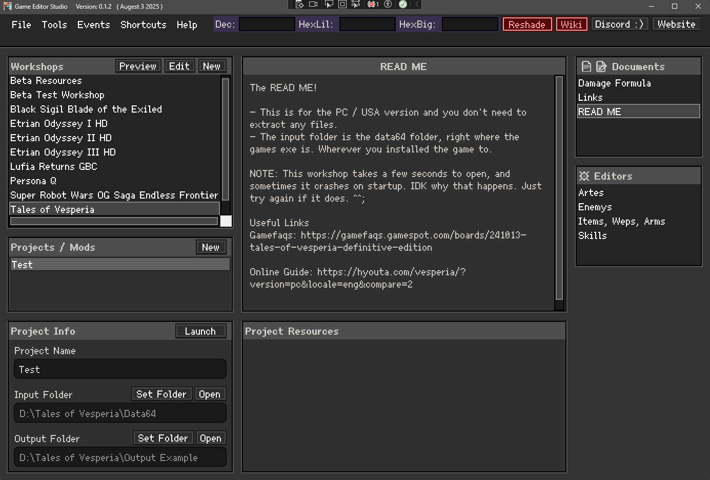
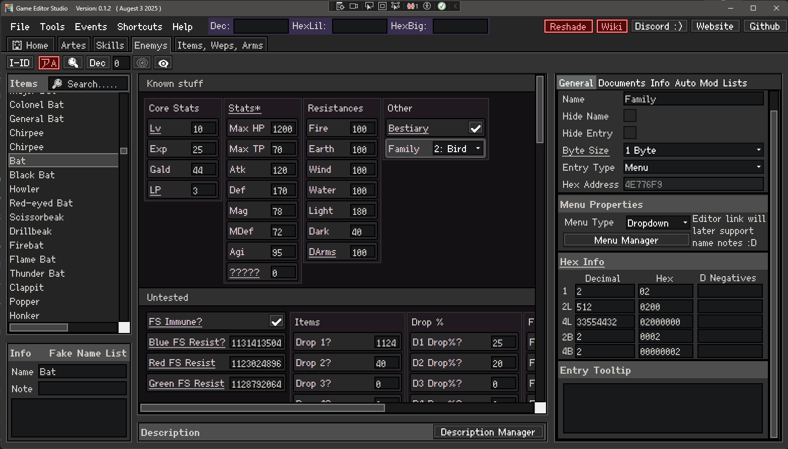

# Game Editor Studio

Game Editor Studio (GES) is a program that lets you create highly customizable editors for video games without any coding knowledge. GES is made with forward compatibility in mind, ensuring that future features will work seamlessly with existing editors.

## [Download Latest Build](https://github.com/dawnbomb/GameEditorStudio/releases/latest)
> Note that automatic updates are not a thing yet, so for now you will need to manually update every so often.

## Getting Started
If you want to create mods using existing editors, first select a game from the workshops list on the left side of the window. A readme will open, and it SHOULD tell you how to extract any game files required. Then create a new project for that workshop, set and input and output folder (Input is game files, output is where your modded files will save to), and launch your project! Your good to go!

If instead you want to create editors for a game noone has ever done before, you will need to create a new workshop for that game. Then make a dummy project for that workshop, launch the workshop, then go to File -> Create New Editor. From there, you can create a new standard editor using a name table and a data table. The name table is a list of names of the things the editor is to be editing, and the data table is the actual data that will be edited. There are tutoials included but if you need help, as me on discord, as it would help me write better tutoials. 

## Introduction

Game editor studio's main features are:

* Create a "workshop" for a game. It holds any number of editors for that game. 
* The "Standard Editor". (Characters, Spells, Classes, Enemys, Weapons, etc).
	* Creating a new one using a name table, and a data table. There are tutorials included. 
	* Each table byte is represented as an "Entry" (Max HP, Str, Gold, etc). 
	* You can freely **move entrys around** into columns, rows, and even "Groups" (basically folders). 
	* Entrys can be turned into checkboxes, bitflags, and dropdown menus. You can even set them to hidden. 
	* Dropdown menus can source text just like an editor, or pull it's name list directly from an existing editor. 
	* You can also give entrys a tooltip, with no size limit.   

* The "Items List" of a Standard Editor.
	* The List of things an editor is actually editing (Weapons, Classes, Spells, etc) are always called "Items".
	* Items can be reordered, and will always save back to the games files in the origonal order!
	* Items can even be sorted into folders! Just right click an item and select "Create Folder".
	* You can give any item a note. Notes appear next to the item name as orange text (so they stand out).
	* You can also give an item a detailed tooltip. Items with tooltips appear underlined, and stand out ontop of notes.
	* Items can be renamed, and they save back to game files. **This is fantastic for making english patches!**
	* More english patch features are also planned! :D 
	* Also, if you add a descriptions table to an editor, users can also edit item descriptions!

* Create a "Text Editor". 
	* A text editor lets you add any number of text files to it. 
	* Text editors are newer and don't have good formatting support yet, but they will in the future.
	* Each text editor can hold any number of files. 
	* Great usage examples, one is an "AI Editor", another is a "Stage event editor". 
	* Basically, they are good for games that use actual text for anything.

* Tools & Events System
	* GES supports 25ish third party tools (HxD Hex editor, UABEAvalonia, Floating IPS, etc)
	* All tools have a download button INSIDE the program.
	* You can declare that your game needs specific tools, like Nitro Packer to unpack and repack nds roms. 
	* You can also declare some "Common Events". Like "Unpack NDS Rom".
	* Any common events enabled for a game will appear in your tools menu as quick events!
	* Aside from Tools, and enabling common events, are also more advanced events.
	* Made to look like the eventing system in RPG maker, you can create complex events to run.
	* Events can chain "Commands" together. There exist all kinds of commands for you to use.
	* A example Event is... [Save Everything] -> [Repack NDS Rom] -> [Run MelonDS with rom]
	* Even a simple event can be useful. [Save Everything] -> [Run target exe] is good for PC games. 
	* By chaining them all together in 1 event, you create a 1 click solution to test your changes!
	* In the future, many more third party tools, and many more commands will be added.   

* Other misc features.
	* You can export any editor into a google sheets table. Then import to google sheets and share online!
	* "Auto-Mod" lets you create simple mods quickly. (All enemys give 0 exp, all items have x2 buy cost, etc) 
	* A Documantation system exists. Workshops can hold any number of text files for you to edit.
	* Project documents exist as well. Create both public (Workshop text files) and private (project text files). 
	* You can preview a workshop. This gives you an idea of what it looks like without the creator needing any screenshots. 
	* From the Library window (before you open a workshop) you can already read the documents of the workshop.
	* If a workshop has a README text file, it will be automatically selected when selecting a workshop to open.
		* There is a shortcuts menu at the top of the screen to open relevant folders on your PC.
	* Most parts of the program, you can right click them and they will have additional options. 
	* A symbology system exists. When enables, entrys tell you information about themself, useful to finding out what they do.
		* for example, "I am always 0 or 1", or "I am only 1~5 and 255, so i probably represent a negative value".

## Future Plans

Honestly there is so many things i want to add to this program. But heres a quick list of things in no particular order.
* Support for creating editors where the data table has each row has a diffrent byte count.
* I want to rework the right bar in the standard editor to be much more refined.
* I want to change the eventing system to one where resources are defined in the events window instead of by the workshop.
* I want to have a in-program "Wiki" that gives tips and tricks on modding games. 
	* I want this because it's really hard to learn game modding techniques. People mislead you SO much... 
* I want to add support for either creating JSON editors, or XML editors. Yes i'm serious. 
* I want to try and have a panel to can open that will attempt to machine translate your game. 
	* automatic english patches, or atleast an idea of what it's supposed to say, would be really cool!
* I want like 50 more tools and 30 more commands.
* I want a button that lets you view an editor's raw data in a hex editor.
* I'd like to add an automtic update installer. 
* Ability to right click a dropdown menu entry, select GOTO, and it opens that item in it's editor.
* A history feature showing your last X items you were looking at in this editor.
* A way to tag a editor as a specific type of editor (Skills, Classes, enemys).
	* When a editor is of a specific type, it's entrys and UI elements reflect that. 
* Even more cool stuff.
* I want to look back at newyears at the end of 2025 and go "WOW, I REALLY MADE THE WORLD A BETTER PLACE!" :D

## README FOR DEVELOPERS

If you want to help develop GES then i'd love to have you! I have a big list of new features i'd like to add and could use the help! Ping me on my discord server, or message me on discord (i'm dawnbomb).  

* GES Project Details
	* Made in visual studio 2022 
	* Made in C# 
	* I'm using .NET9
	* Framework is WPF. It's not Avalonia UI because Avalonia is missing Toolbox support and me being new really needs it D: (I will CONSIDER revisiting Avalonia when Accelerate releases as it's supposed to have toolbox support).
	* This my first ever project. I taught myself how to code to make this, so i'm sure there is lots of bad code, and that i'm not following standards at all. 

* NuGet Packages used: 
	* Ookii.Dialogs.Wpf by OOkii Dialogs Contributors  (used for selecting files, appearently WPF has literally no way to do this by defalt, yes really)
	* System.Text.Encoding.CodePages by Microsoft  (Used to decode and re-encode english and japanese text from hex)
	* EPPlus by EPPlus Software AB (used in the feature that lets you export editors, but is intended to be imported to google sheets and shared online)
	* WPFHexaEditor by Derek Tremblay (Not actually used yet, but it will be in the future to allow another way to visualize the editor data)
	* Appearently i'm using Microsoft.NET.ILLink.Tasks although i don't remember adding it. 

Note: Not exactly a package, i don't even know really, but, i right clicked my project, did Add, COM reference..., and added Windows Script Host Object Model. I did it because i setup a built in reshade installer and i needed it to create a windows shortcut. Theres probably a better way to do this, but that is super not my problem ;D

# History (for lore enjoyers)

This started as Etrian Editor, then became Crystal Tools, then Crystal Editor, and now Game Editor Studio. :3

### Prologue: 
I had previously released all kinds of english menu patches and mods. I had some seriously good reverse engineering experience, but no coding knowledge at all. 

I was already *very good* at finding where game data was, but so were plenty of other people. Learning new techniques however was/is FUCKING AWFUL. Not because learning a new technique your being taught is hard, infact thats the easy part. Instead it's how NOONE WILL TEACH YOU PROPERLY, everyone always says some shit about how it's "impossible", how there are no universal techniques, how every game is "unique" (extremely wrong), and as a result theres no good solid learning resources online. 

Any tutorials online are extremely narrow and for one specific game, and don't teach you how to apply the same techniques elsewhere. And thats if you can even find them. I remember learning from someone named Ethanol quite a lot to teach me reverse engineering, and then boom i learn a few universal techniques and now i feel like i'm a serious veteran. 

But theres one VERY BIG problem. Theres lots of people who can data mine games, once you know the right techniques it's easy for 90% of all games to find where the stuff like enemy data or spell data is. However NOONEEEEE can make editors. That requires coding, and NOONEEE knows how to code, thats a WAYYY harder skill set to learn! Learning to data mine games is so easy that with a tutor you can be skilled in only a few days, but because coding takes you months to YEARS to learn, people are unironically dumping game info into fucking google sheets, editing it, and then pasteing it back to the game files to mod games. 

And I decided. I wanted this to be better.  

### The 2021 Etrian Editor: 
Around early to mid 2021 i started getting seriously interested in making actual editors. I wanted to make a difficulty mod for Etrian IV (i love difficulty mods) and I wanted to know how to go from knowing where game data is (like enemy data) to creating an actual editor. 

I contacted someone named violentlycar who had been making a complex etrian map editor, as well as a special etrian odyssey 3 hack that added a new magic resistance stat, and had him teach me some VERY beginner C# coding. I basically just reused something he made and i edited it to do what i wanted. I took his editor and made it so the textboxes would point to the file locations i wanted in etrian IV. For the enemy name list, I didn't know how to code to make it automatically read the enemy names from the game file, so instead i manually copy pasted them from the game files and had 400 lines of copy-paste code that looked like EnemyTree.Add(EnemyName); over and over and over. So... I was extremely bad. 

BUT, thanks to his help I brute forced my way into making an extremely basic Etrian Odyssey IV Enemy Editor. From there i further reused the code the exact same way (including manually filling the name list) to make other editors for Etiran IV (Weapons, Items, Skills, etc). I later decided to expand this and make editors for Etrian 1 as well, and even made templates for other etrian games. This is it!!! I would make the ultimate editor for etrian games!!! THE ETRIAN EDITOR!!! WAOW!!!!!1!!1! 

### The 2022 Crystal Tools: (Jan 2022)
After awhile (towards the end of 2021) I got more ambitious. I started helping someone named SCArkadia with his persona 4 difficulty mod, and i got the itch to take my etrian editor even further. It was so easy to copy paste my way into creating new game editors, stupidly easy, why stop here?? Just assign a new file location for a new game, and boom a new editor?! Getting only the most barebones of assistance changed things to feeling impossible easy! And so, i started expanding it. 

I made editors for tales of vesperia, Persona Q, and even fire emblem three houses. I also made templates for touhou labyrinth 2 as i had been modding that as well, and around this time i think i released my tales of hearts DS, tales of rebirth, and tales of Keroro english patches, and even my tales of the world patch. 

At the start of 2022 i rebranded it into Crystal Tools, put it all together, and uploaded it to github! I uploaded it on January 18 2022. Available here!: https://github.com/dawnbomb/Crystal-Tools I also put together my website and formalized all my releases into my own website www.CrystalMods.com This way i won't be limited by any website mod teams. And i wanted to keep going.

### The 2022 Crystal Editor V1: (Rest of 2022, Moving, and hiring a programmer)
My roommate started becoming abusive mid 2021, so it was time i moved the fuck out. I had recently met a now good friend of mine Tsubasa and he agreed to help me move! Febuary 2022 i said goodbye to my parents, the last time i would ever see them, and i moved. I spend ALOT of time adjusting to the new location, but after 3 months i still had a burning desire to push Etrian Tools even further. 

Assigning new file locations was SO easy, it's that easy to make a editor? It seemed so easy, surely, a program could be made where users can just select the file locations outside of a coding enviroment?! Normal people would be able to make game editors, I NEEDED THISSSS!!! All i needed to do was make the entire creation process (not very much at all) of an editor to be modular! An editor creator if you will, or an editor...editor! An editor that create and edits editors themself. I WANTED ITTTTT. VERY BADLYYYY. 

Buuut... all i had been doing upto this point was copy pasteing text around and editing code that other people made. I still didn't know at all how to code... so... i did what any normal person would do, and... no, just kidding, no i didn't. Instead i made an account on Freelancer.com and tried to hire an actual programmer! 

Awhile later in augest of 2022 i suceeded. I had my new programmer hire make a proof of concept, i still have images of this time, and it was glorious! Ugly as fuck, HORRIBLE, but i did the concept, IT WAS GLORIOUS!!! He made it in visual basic, and i only knew how to copy paste some C# so i was back to not even having any idea at all. But it existed! He finished my prototype in Nov 16 2022. 

Now, there were lots of problems, i don't even remember them all but i have backups from the time. I wanted workshops to have their own art banners so users can personalize them. The program only game the library and the workshops themself, no events or anything else. It was also in winforms, but... it was functional!

### End of 2022, Learning to Code: 
During 2022 i started meeting people in this new location i moved to, and in october 2022 i met a furry who actually knew how to code! I begged him to teach me, just some very basics, and he agreed! It was only a few days, but I learned a LOT during this time, and i finally started to understand what a class is! haha. 

Honestly my biggest suprise during this time was learning that learning to code was so easy. When your not being forced into tons of computer science classes that talk about internet protocols and tons of other shit that have nothing to do with coding, it's actually extremely easy to learn to code. I think all i needed was a human to be able to ask basic questions to, get an immediete answer, and thus know what to do instantly to learn the basics super fast. Keep in mind chat GPT was only soon going public for the first time, so no, i could not have replaced my teacher with AI. Overall it took less then a month to master beginner coding, and that was honestly more then enough to do 99% of things.
### The 2023 Crystal Editor V2:

So, he had been teaching me for about a month when my linked in programmer's proof of concept for Crystal Editor V1 finished. 48 later i recieved it (around Nov 18 2022), i was SO ready to start improving it. (Also i can't afford to keep him, so buh-bye random linked in programmer).

The proof of concept was in winforms, but i had learned from my teacher that winforms is pretty garbage and no good going forward. I immedietly started many sleepless nights coding from scratch an all new Crystal Editor V2, with many lessons here and there from the furry coder dude. 

Now being made in WPF, it will be perfect, and it will change the world. I worked and worked, and by June 17 2023 i finally uploaded it on github! https://github.com/dawnbomb/Crystal-Editor A WPF based editor editor! ALL MINE! ALL CODED MYSELF! I DIIID IIIIIIT!!!! I kept myself motivated with a daily accomplishments lists aiming for 30 a day. They could be comically tiny goals, even something as small as changing a single color. The tasks being able to be so small made it hard to procrastinate, "I don't feel like finishing, i'll just make up 8 random nothing tasks, do them super quick, and say im done". But each micro task completed adds up VERY fast. I even had tasks like "Find X knowledge on google" without requiring actually reading it, that can be its own task, or "Make a new window appear", but it can be blank and filling it can be a seperate task. 

It was tough. but June 2023 i released it.  WOOOOOO! 

### The First Demo (CEV2) (June 2023)

I pushed hard, learned coding as fast as i could, and my main goal was getting a demo out. But i knew, it wasn't good enough. My Test editors at the time were for etrian IV and SRW OG Saga endless frontier, and SRW was rough. That game is weird, it has a rom inside its rom (yes really), and repacking nds roms was best done with command prompt. It was awful. 

And so, i had the idea for an events system. I made it special for SRW at the time, something to automatically run a repack command. But i already felt it burning it me, it needed to be a program-wide feature. Something where users could make anything happen to any game's files. But I needed more time. More features to add. Ability to support japanese text for english patches. And most importantly, i wanted to be able to change the file structure of things saved to peoples computers. Doing that would make any editors someone makes now not compatable with future versions of the program. 

So i made a compromise. I made the program ready for June 14th, the day Etrian Odyssey I HD releases on steam. I made editors for it, and i released a "Demo" with Etrian I HD editors, but with the ability to make new editors disabled. This way people wont make new editors and then be encouraged to not update to new versions of the program (because doing so would break existing editors).  
A link to Demo 1, AKA the Etrian I HD Editors Demo, is still available here: https://www.crystalmods.com/utilities/crystal-editor/

### New Friends: (June Q3-Q4)
So, I was very happy, and frankly, very burnt out. So i decided to stop and go on break. I started trying to spend more time meeting people, and unfortunatly lost both my coder furry teacher due to him moving, and my only other local friend i had made Vez who decided to end all his friendships with **everyone** and live a diffrent life (???HELLO???). 

I was very sad, and it deeply set in how little people (noone) i knew in this place i moved to. I went on break and spent every week looking for people. I was going downtown atleast once a week to in person events. I vividly remember meeting my new friend Reo around halloween of 2023. We had a very memorable first meeting at a **terrible** gamer event where afterwards we went to go to a mcdonalds, and following google maps took us to... a place where the entire city block was just gone. Like a 50ft deep square hole in the ground of an entire city block was just fucking missing. LOL. We both laughed until we cried, it was genuinly amazing. 

### The 2024 Crystal Editor V3:
Long story short, after recovering, i got back to Crystal Editor and ended up refactoring (remaking) the code for most of the entire program throughout 2024. I added most of the core of what it looks like today. This version ended around October. 

October is also when i met a new friend patrick, i was walking to to wallmart one day, he saw my shirt and stopped to tell me i looked great, and i friended him on discord right there. He even moved in next door to me, he was a playstation platinum hunter (someone who 100%s games), and i finally started feeling like i knew enough people where i lived to be okay. It was very cool to him live next to me, i have never had this before, i was genuinly happy.  

### The 2025 Crystal Editor V4: (Upto June 7)
I took a break from coding in october meeting patrick, but Christmas 2024 i got to work again. I wanted to add support for text from many diffrent sources, text editor support, japanese text support, make and refine the events system, make a proper tools system, and much more. I also learned about user controls and started using them a lot (Yes, nothing was a control up to this point). I wanted to make every part of the program support infinite size scaling in a easy to work with way. I worked nonstop and it payed off.

### Game Editor Studio (June-July 2025) FIRST PUBLIC RELEASE! (v0.1.1)
Closing in to my big proper release, june was a month dedicated to bug smashing, and adding tiny QoL EVERYWHERE. I didn't add almost any new features, and cut my losses on features i didn't finish adding yet (like better translation support, so that will come post release). 

During this time i also gave the entire program a graphics / style overhaul. I wanted it to look like a GBA or SNES game. A big chunky cursor, blocky corners, big bold lines, and i searched far and wide for a perfect font. Finding a perfect font was actually very hard, turns out most pixel art fonts only do the 24 english characters and not the 2000 japanese ones (thats like 100x more work). Heh. So yeah this was great. Come july 3rd, I silent released. I gave it version number 0.1.1 so it would have a long way to grow. I don't want to be one of those programs thats on "Version 12.33.2" or some shit.  You don't get a good idea of how far something has come like that. Start small, grow big over time. :3

I also rebranded it into Game Editor Studio. Basically, i thought the name Crystal Editor (CE) would clash to hard with Cheat Engine (CE) so i wanted a new name. I also wanted it to be more descriptive and a bit more telling in name as to what it does. After lots of thought (I kept think about a tool made by Testrunners named S.M.A.R.T, the Super Metroid Automatical Repoint Tool) i eventually landed on Game Editor Studio. It's not a name acronym i know. But thinking on it, i don't want it to be. I don't want it so easy for people to call it by another name, i want them saying "Game Editor Studio". I think if thats what it's called, if people use that name in public chats, others will be interested in something with that name and it will spread faster. :)

Now, i wanted the release to be more eventful, i wasn't planning a silent release, it was going to be grand. But uh, patrick DIED, all of a sudden. I wanted more time to collect myself, but still release, so i did a silent release, said to myself "I did it, your dead now, you can't see it, but i did it dude". And...yeah. I really cried my fucking eyes out. Patrick, you **are** missed, ***very much***. 

### July 2025: (As of writing, July 10)
I spent 7 days dedicated purely to IRL catchup. Tiny changes to GES, but mostly stuff like updating my computer's BIOS, fully cleaning out my email, washing my floors, doing research on new programs that came out the last few years (Like NoMoreBorders beating out BorderlessGaming) and meeting people (Patrick dead, another friend lost, and with only reo left and noone else to fill the void in my heart, i need some new gamers in my life). 

I have about 30 more things on a list to catch up on IRL i wanna do this month, then actually advertise the program sometime in augest. But hey, this github page is looking kinda nice now right? That took some of this july time as well. Gotta have a nice landing page for people to go OOOO DOES THIS PROGRAM REALLY EXIST? OMG! YES YES YES! Hahaha. Well, we will see what i write next in this history section. Bye bye for now! :)

### Augest 2025 - June 2026:
Welp, i'm writing this now one whole ass year later. 

Back in augest 2025 i got a TON done, visual overhauls all over, eventing system overhaul, and in september i added a new event command for users to write their own custom commands in command prompt. Should be an end-all answer to advanced users dealing with edge case scenarios. I pushed a v0.2 update in augest.

Turns out Patricks death hit me a LOT harder then i could handle. I actually made a v0.2.5 update in september, it polished events, added small QoL, and changed GES to be a single window program. And then I just... didn't have the willpower to release it. I even left my entire program's source code at my friend reo's in september. With patrick being an endless void in my heart, I just didn't have the willpower to go pick it up untill the start of 2026. 

January update for v0.2.8, and i also didn't release it. It was a ton of QoL all over the program. In my release notes, i said i was excited for release, and this was true, but man was i also lonely. (also yes, i made release notes for an update i did not actually release). In march a made a v0.3 (that also did not release). It had actually been working quite a bit, and this for the first time in awhile included tons of new features. It very importantly also completly redid how entrys are generated and appear, and while there was lots of QoL, a big focus was on future proofing. I wanted to do a proper release, something i feel is sufficently future proof. It's hard to define what exactly makes something future proof. I started focusing on the possibility of failure and adding fail-safes, like a greater focus on being able to export old editor info incase users need to remake editors in a later version, and i completly changed editor creation as well. Instead of filling out info for a new editor, you immedietly get a new editor, and can now edit ALL of it's info post-creation. users also load a project AFTER entering a workshop, instead of from the game library. The program became way more streamined, but again, no update was pushed.

In june, someone contacted me interested in using it for golden sun dark dawn, and i finally updated the program to the new .net10 and actually pushed my v0.3 update. 

### July 2026 Onward:
After just finally releasing my v0.3 update, i finally (one whole year later) feel mentally recovered enough to work on GES again. For a long time I still only had my one friend here Reo, but a month ago i met someone and we started reading umineko and playing fire emblem, it's been fun times. 

So far i'm working on a v0.3.2 update, again focusing on QoL. My QoL obsession comes from wanting it future proof, and while i make small future proofing changes here and there, i mostly want to focus on still actually improving the program, while also taking a fuckload of time to answer some questions that will have extremely long term impacts, and be mostly a point of no return. The kind of dev questions where changing your mind later necessarily means making all previously existing workshops/editors completly unusable in the new version. (So i had better make sure no such thing happens and my answers are correct from the start). 

At the time of writing this, my big questions are...

Questions i should not delay, the sooner the better:
- Should i have some way for users to verify a workshop works perfect with a specific version of GES? Like, "Last verified: GES v0.3" or something? Would users even manually verify? More importantly, they could "verify" for a new version that actually does something like strip dev comments from an old editor due to changes in how notes are handled in the future, and then what, because someone made that mistake, all those get lost? Maybe not even allowing manual verification is best? Whats the alternative? I have "First created for GES v0.x" already, but it could make use of features only added in later GES versions. I could have a "Last saved with GES v0.x" but thats little diffrent from users incorrectly manually verifying a workshop works just because nothing *appears* broken.
- A big new feature i want to add, is "Styles". I want users to be able to visually customize the entire workshop and every part of every editor. The border frames of things, the individual boxes of game data like make enemy HP have a green box or something, maybe let users replace the text "HP" with png image. Even let users add "Stickers" to editors. The big advantage of releasing GES very publicly with this already implimented is every workshop will look very unique. The downside is there is a lot of questions to answer for this process, so it delays my big public announcements. 

Questions i can delay, but probably should not?: 
- XML / JSON support. I want GES to also be able to make editors from text files. Unreal Engine and Unity are becoming more popular for JRPGs, and support for these would be big. If i want to add support... should they be their own seperate editor? Should they be the same? If it's seperate, it won't automatically support new features i add to the basic data table editors. But if it's not seperate, i can't add support for new features unless everything supports it. Ontop of this, any reworks of any features instantly get multiplied in how much work is required. Ughhh. Atleast fire emblem fortunes weave is probably using data tables again. FE Engage using unity was crazy. I know i said unity was getting more popular, but it's really only unreal engine, and really only with square enix. Engage is the only unity JRPG in forever, and other companys are not making UE5 JRPGs. Still, i get the feeling UE6 will have even more JRPGs then UE5, and once unreal engine adds proper sprite support, (and ditches it's shitty particle system and makes a new one) i think it will explode in usage. Hrmm.... lots to think about.
- I should setup some kind of way for users to submit new workshops, and updates to workshops. I'm currently thinking of using the new discord forumn feature, and adding a submit button in program that generates a request inside discord. Alternativly, i could make a github page that exclusivly has workshops / editors. The program can check it for new versions and prompt to update automatically. The negatives are... if this is ever taken down, well thats pretty bad. But maybe i should just go with it, i can always change how they are gotten later. 

Also:
- On the topic of XML / Json support, i have ideas for some very useful new entry types, but i'm holding back on adding them until i know if they need to support that or not.
- Worst of all, i could imagine a game that stores names in a XML or JSON, but the game data it's for is stored in a data table. In such a case, it would be **necessary** for a "Standard Editor" to support names from one but game data from another. Urk.. This is probably unrealistic, and i could tell those people to use a fake name list, but maaan does it make answer the question harder. 
- I kinda want a patreon or something, some way for people to support development. Is that crazy? I know it's flying close to the sun, but other emulators have one, so...???
 

## Lisence / Legal stuff.

- This program makes it easy to create editors, mods, patches, etc. Anything you create is a "contribution" and if i see your stuff online i can and will be adding them to this main download. 
- This is not open source. *FOR NOW.*
- But only because i spent like 120+ hours trying to understand all kinds of legal stuff between open source, lisences, terms and conditions, EULAs, CLAs, ICLAs, and more, and it was melting my brain and eating up WAY TO MUCH OF MY TIME vs actually developing the damn thing.
- This is just a complaint but, i can't believe how impressivly *unhelpful* r/opensource is at actually helping people understand how to make their project be open source. I got so many replies saying "You don't need this", "It's easier not to", "Theres no need". I KNOW THERES "NO NEED" BUT I'M ON R/OPENSOURCE FOR A REASON YOU FFFFffff.....SDLJFDSLKJFS!!!! LIKE OMG DUDE! ARRRRRGGGG!!!!!
- Anyway, its not open source only because it's been a legal nightmare. If you want something, just reach out to me on discord and i'll give you permission in the form of a written message.

